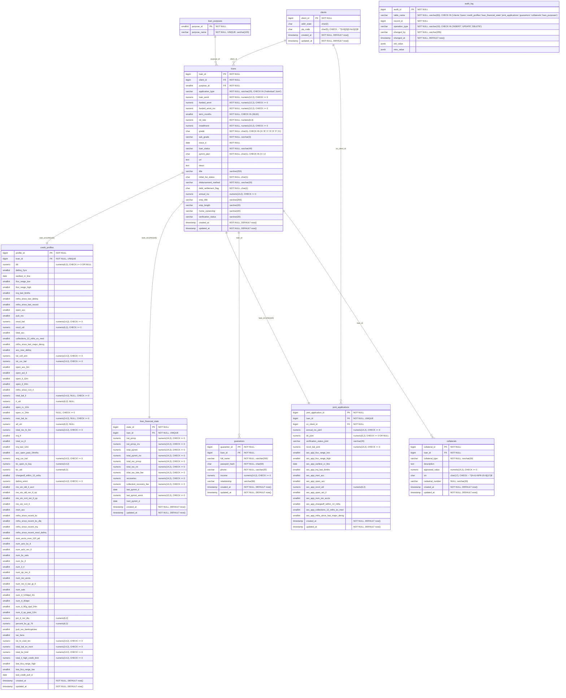

# ER-диаграмма

> Составное UNIQUE (loan_id, passport_hash) в guarantors не выражается синтаксисом Mermaid ER — в диаграмме показан только косвенно.

```mermaid
erDiagram
    loan_purposes ||--o{ loans : "purpose_id"
    clients ||--o{ loans : "client_id"
    clients ||--o{ joint_applications : "co_client_id"
    loans ||--|| credit_profiles : "loan_id (UNIQUE)"
    loans ||--|| loan_financial_state : "loan_id (UNIQUE)"
    loans ||--|| joint_applications : "loan_id (UNIQUE)"
    loans ||--o{ guarantors : "loan_id"
    loans ||--o{ collaterals : "loan_id"

    loan_purposes {
        smallint purpose_id PK "NOT NULL"
        varchar purpose_name "NOT NULL, UNIQUE, varchar(100)"
    }
    clients {
        bigint client_id PK "NOT NULL"
        char addr_state "char(2)"
        char zip_code "char(5), CHECK ~ '^[0-9]{3}[0-9xX]{2}$'"
        timestamp created_at "NOT NULL, DEFAULT now()"
        timestamp updated_at "NOT NULL, DEFAULT now()"
    }
    loans {
        bigint loan_id PK "NOT NULL"
        bigint client_id FK "NOT NULL"
        smallint purpose_id FK "NOT NULL"
        varchar application_type "NOT NULL, varchar(20), CHECK IN ('Individual','Joint')"
        numeric loan_amnt "NOT NULL, numeric(12,2), CHECK >= 0"
        numeric funded_amnt "NOT NULL, numeric(12,2), CHECK >= 0"
        numeric funded_amnt_inv "NOT NULL, numeric(12,2), CHECK >= 0"
        smallint term_months "NOT NULL, CHECK IN (36,60)"
        numeric int_rate "NOT NULL, numeric(6,3)"
        numeric installment "NOT NULL, numeric(10,2), CHECK >= 0"
        char grade "NOT NULL, char(1), CHECK IN ('A','B','C','D','E','F','G')"
        varchar sub_grade "NOT NULL, varchar(3)"
        date issue_d "NOT NULL"
        varchar loan_status "NOT NULL, varchar(40)"
        char pymnt_plan "NOT NULL, char(1), CHECK IN ('n','y')"
        text url
        text descr
        varchar title "varchar(255)"
        char initial_list_status "NOT NULL, char(1)"
        varchar disbursement_method "NOT NULL, varchar(20)"
        char debt_settlement_flag "NOT NULL, char(1)"
        numeric annual_inc "numeric(14,2), CHECK >= 0"
        varchar emp_title "varchar(255)"
        varchar emp_length "varchar(20)"
        varchar home_ownership "varchar(20)"
        varchar verification_status "varchar(20)"
        timestamp created_at "NOT NULL, DEFAULT now()"
        timestamp updated_at "NOT NULL, DEFAULT now()"
    }
    credit_profiles {
        bigint profile_id PK "NOT NULL"
        bigint loan_id FK "NOT NULL, UNIQUE"
        numeric dti "numeric(6,2), CHECK >= 0 OR NULL"
        smallint delinq_2yrs
        date earliest_cr_line
        smallint fico_range_low
        smallint fico_range_high
        smallint inq_last_6mths
        smallint mths_since_last_delinq 
        smallint mths_since_last_record 
        smallint open_acc
        smallint pub_rec
        numeric revol_bal "numeric(14,2), CHECK >= 0"
        numeric revol_util "numeric(6,2), CHECK >= 0"
        smallint total_acc
        smallint collections_12_mths_ex_med
        smallint mths_since_last_major_derog 
        smallint acc_now_delinq
        numeric tot_coll_amt "numeric(14,2), CHECK >= 0"
        numeric tot_cur_bal "numeric(14,2), CHECK >= 0"
        smallint open_acc_6m 
        smallint open_act_il 
        smallint open_il_12m 
        smallint open_il_24m 
        smallint mths_since_rcnt_il 
        numeric total_bal_il "numeric(14,2), NULL, CHECK >= 0"
        numeric il_util "numeric(6,2), NULL"
        smallint open_rv_12m 
        smallint open_rv_24m "NULL, CHECK >= 0"
        numeric max_bal_bc "numeric(14,2), NULL, CHECK >= 0"
        numeric all_util "numeric(6,2), NULL"
        numeric total_rev_hi_lim "numeric(14,2), CHECK >= 0"
        smallint inq_fi 
        smallint total_cu_tl 
        smallint inq_last_12m 
        smallint acc_open_past_24mths
        numeric avg_cur_bal "numeric(14,2), CHECK >= 0"
        numeric bc_open_to_buy "numeric(14,2)"
        numeric bc_util "numeric(6,2)"
        smallint chargeoff_within_12_mths
        numeric delinq_amnt "numeric(14,2), CHECK >= 0"
        smallint mo_sin_old_il_acct
        smallint mo_sin_old_rev_tl_op
        smallint mo_sin_rcnt_rev_tl_op
        smallint mo_sin_rcnt_tl
        smallint mort_acc
        smallint mths_since_recent_bc
        smallint mths_since_recent_bc_dlq 
        smallint mths_since_recent_inq 
        smallint mths_since_recent_revol_delinq 
        smallint num_accts_ever_120_pd
        smallint num_actv_bc_tl
        smallint num_actv_rev_tl
        smallint num_bc_sats
        smallint num_bc_tl
        smallint num_il_tl
        smallint num_op_rev_tl
        smallint num_rev_accts
        smallint num_rev_tl_bal_gt_0
        smallint num_sats
        smallint num_tl_120dpd_2m
        smallint num_tl_30dpd
        smallint num_tl_90g_dpd_24m
        smallint num_tl_op_past_12m
        numeric pct_tl_nvr_dlq "numeric(6,2)"
        numeric percent_bc_gt_75 "numeric(6,2)"
        smallint pub_rec_bankruptcies
        smallint tax_liens
        numeric tot_hi_cred_lim "numeric(14,2), CHECK >= 0"
        numeric total_bal_ex_mort "numeric(14,2), CHECK >= 0"
        numeric total_bc_limit "numeric(14,2), CHECK >= 0"
        numeric total_il_high_credit_limit "numeric(14,2), CHECK >= 0"
        smallint last_fico_range_high
        smallint last_fico_range_low
        date last_credit_pull_d
        timestamp created_at "NOT NULL, DEFAULT now()"
        timestamp updated_at "NOT NULL, DEFAULT now()"
    }
    loan_financial_state {
        bigint state_id PK "NOT NULL"
        bigint loan_id FK "NOT NULL, UNIQUE"
        numeric out_prncp "numeric(14,2), CHECK >= 0"
        numeric out_prncp_inv "numeric(14,2), CHECK >= 0"
        numeric total_pymnt "numeric(14,2), CHECK >= 0"
        numeric total_pymnt_inv "numeric(14,2), CHECK >= 0"
        numeric total_rec_prncp "numeric(14,2), CHECK >= 0"
        numeric total_rec_int "numeric(14,2), CHECK >= 0"
        numeric total_rec_late_fee "numeric(14,2), CHECK >= 0"
        numeric recoveries "numeric(14,2), CHECK >= 0"
        numeric collection_recovery_fee "numeric(14,2), CHECK >= 0"
        date last_pymnt_d
        numeric last_pymnt_amnt "numeric(12,2), CHECK >= 0"
        date next_pymnt_d 
        timestamp created_at "NOT NULL, DEFAULT now()"
        timestamp updated_at "NOT NULL, DEFAULT now()"
    }
    joint_applications {
        bigint joint_application_id PK "NOT NULL"
        bigint loan_id FK "NOT NULL, UNIQUE"
        bigint co_client_id FK "NOT NULL"
        numeric annual_inc_joint "numeric(14,2), CHECK >= 0"
        numeric dti_joint "numeric(6,2), CHECK >= 0 OR NULL"
        varchar verification_status_joint "varchar(20)"
        numeric revol_bal_joint "numeric(14,2), CHECK >= 0"
        smallint sec_app_fico_range_low
        smallint sec_app_fico_range_high
        date sec_app_earliest_cr_line
        smallint sec_app_inq_last_6mths
        smallint sec_app_mort_acc
        smallint sec_app_open_acc
        numeric sec_app_revol_util "numeric(6,2)"
        smallint sec_app_open_act_il
        smallint sec_app_num_rev_accts
        smallint sec_app_chargeoff_within_12_mths
        smallint sec_app_collections_12_mths_ex_med
        smallint sec_app_mths_since_last_major_derog 
        timestamp created_at "NOT NULL, DEFAULT now()"
        timestamp updated_at "NOT NULL, DEFAULT now()"
    }
    guarantors {
        bigint guarantor_id PK "NOT NULL"
        bigint loan_id FK "NOT NULL"
        varchar full_name "NOT NULL, varchar(255)"
        char passport_hash "NOT NULL, char(64)"
        varchar phone "NOT NULL, varchar(20)"
        numeric income "numeric(14,2), CHECK >= 0"
        varchar relationship "varchar(50)"
        timestamp created_at "NOT NULL, DEFAULT now()"
        timestamp updated_at "NOT NULL, DEFAULT now()"
    }
    collaterals {
        bigint collateral_id PK "NOT NULL"
        bigint loan_id FK "NOT NULL"
        varchar collateral_type "NOT NULL, varchar(30)"
        text description
        numeric appraised_value "numeric(14,2), CHECK >= 0"
        char vin "char(17), CHECK ~ '^[A-HJ-NPR-Z0-9]{17}$'"
        varchar cadastral_number "NULL, varchar(30)"
        timestamp created_at "NOT NULL, DEFAULT now()"
        timestamp updated_at "NOT NULL, DEFAULT now()"
    }
    audit_log {
        bigint audit_id PK "NOT NULL"
        varchar table_name "NOT NULL, varchar(63), CHECK IN ('clients','loans','credit_profiles','loan_financial_state','joint_applications','guarantors','collaterals','loan_purposes')"
        bigint record_id "NOT NULL"
        varchar operation_type "NOT NULL, varchar(10), CHECK IN ('INSERT','UPDATE','DELETE')"
        varchar changed_by "NOT NULL, varchar(255)"
        timestamp changed_at "NOT NULL, DEFAULT now()"
        jsonb old_value 
        jsonb new_value 
    }
```